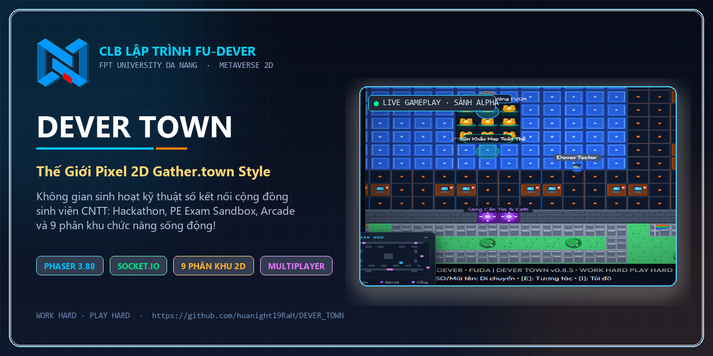

<div align="center">

<a href="https://github.com/huanight19RaH/DEVER_TOWN">
  
</a>

# 🎮 DEVER TOWN

### Thế Giới Pixel 2D Multiplayer của CLB FU-DEVER · FPT University Đà Nẵng

[](./LICENSE)
[](./package.json)
[](https://phaser.io)
[](https://nodejs.org)
[](https://socket.io)
[](https://vitejs.dev)
[](./src/config/i18n.js)

<p align="center">
  
</p>

> **WORK HARD - PLAY HARD** · Không gian sinh hoạt kỹ thuật số Gather.town style dành riêng cho cộng đồng lập trình viên FUDA.  
> Gặp gỡ, học tập chuyên sâu, giải trí arcade, thi đấu thể thao ảo và khám phá 9 phân khu chức năng sống động!

🌐 [Landing Page](https://www.fudever.com/) &nbsp;·&nbsp; 📘 [Fanpage FU-DEVER](https://www.facebook.com/FPTUDever) &nbsp;·&nbsp; 📝 [Đăng Ký Thành Viên](https://forms.gle/2us1yB5Qp2HYejj28) &nbsp;·&nbsp; 🐙 [GitHub Org](https://github.com/fudever-club)

</div>

---

## 🌟 Tổng Quan Tính Năng Hệ Thống

DEVER TOWN là một nền tảng Metaverse 2D Pixel Art hoàn chỉnh, kết hợp giữa môi trường cộng đồng (Gather.town style), không gian học thuật CNTT và hệ sinh thái giải trí đa tầng.

```
                                  ┌───────────────────────┐
                                  │   TÒA ALPHA (SẢNH)   │
                                  │   Linh vật Cóc Vàng   │
                                  └───────────┬───────────┘
                 ┌────────────────────────────┼────────────────────────────┐
                 ▼                            ▼                            ▼
      ┌───────────────────────┐   ┌───────────────────────┐   ┌───────────────────────┐
      │   TÒA GAMMA (LAB)     │   │ TÒA BETA (THƯ VIỆN)   │   │  KHU THỂ THAO FUDA    │
      │ Code Sandbox + Server │   │ PE SWE201c + Lofi Pomo│   │ 11m + Bóng Rổ + Bơi   │
      └──────────┬────────────┘   └───────────────────────┘   └───────────────────────┘
                 │
                 ▼
      ┌───────────────────────┐   ┌───────────────────────┐   ┌───────────────────────┐
      │ ARCADE & ROBOT HUB    │   │  KHÔNG GIAN WEB & IT  │   │  CĂN TIN & CAFE LOUNGE│
      │ Snake, Sokoban, Gold  │   │ Landing + IT Helpdesk │   │ Thực đơn thật + Barista│
      └───────────────────────┘   └───────────────────────┘   └───────────────────────┘
```

---

## 🗺️ 1. Bản Đồ & 9 Phân Khu Chức Năng 2D

Hệ thống gồm 9 bản đồ (Map Grid 25x19 tiles = 800x608 px) kết nối liền mạch qua các **Cổng Dịch Chuyển (Portal)** có cơ chế Cooldown chống kẹt cổng an toàn. Vườn Trà FUDA là một vùng tương tác trong Tòa Alpha, không phải bản đồ thứ mười:

| Phân Khu | Tên & Đặc Điểm | Vùng Tương Tác `[E]` Nổi Bật |
|:---|:---|:---|
| 🏛️ **Tòa Alpha (Sảnh Chính)** | Trọng tâm hội trường trường, kết nối toàn bộ các khu vực | Sơ đồ bản đồ toàn cảnh FUDA, Màn chiếu Slide đón tiếp, Sân khấu họp toàn thể, Cóc Vàng Tâm Linh |
| 💻 **Tòa Gamma (Tech & AI Lab)** | Không gian Hackathon, trạm máy chủ và trạm code nhóm | 2 Bàn Hackathon Code Sandbox (Alpha & Beta), Bảng sơ đồ kiến trúc, Bàn họp kỹ thuật |
| 🕹️ **Tòa Gamma Plus (Arcade Studio)** | Khu vực máy game retro cổ điển & trung tâm game robot CLB | Máy game Rắn Săn Mồi, Máy Buggy Đẩy Hộp, Cóc Vàng Đào Kho Báu, Trạm tải Game Robot DEVER |
| 📚 **Tòa Beta (Thư Viện Tri Thức)** | Phòng tự học yên tĩnh, tài liệu ôn thi và quầy cafe | Tủ Cẩm nang ôn thi PE SWE201c, Quy chế hoạt động CLB, Quầy Cafe Lofi & Pomodoro, Bàn sổ tay code |
| 🏆 **Phòng Triển Lãm Kỷ Niệm** | Bảo tàng vinh danh thành tích & lịch sử 9+ năm FU-DEVER | Trạm Lịch sử 9+ năm, Bảng vàng 20+ giải thưởng ICPC & Hackathon, Album Teambuilding Biển Sơn Trà |
| 🌐 **Không Gian Web & IT Helpdesk** | Không gian số nhúng các cổng thông tin và dự án CLB | Cổng phần mềm thi EOS/PE & IT Helpdesk, Landing Page CLB, Member Portal, Kho dự án GitHub, Đơn tuyển quân |
| 📰 **Media Hub Học Vụ** | Cổng tiện ích học tập FPTU và mạng xã hội truyền thông | Cổng FAP, FLM, LMS FPTU, Fanpage CLB, TikTok FUDA, Kho GitHub Org |
| ⚽🏀 **Khu Phức Hợp Thể Thao** | Sân bóng cỏ nhân tạo, sân bóng rổ, cầu lông, hồ bơi | Sân Bóng Đá Mini 11m, Sân Bóng Rổ 3 Điểm, Sân Bóng Chuyền & Cầu Lông 1v1, Hồ bơi thư giãn |
| ☕🍽️ **Căn Tin & The High Deli** | Không gian ẩm thực sinh viên & lounge đồ uống | Quầy thực đơn 3 căn tin thực tế tầng 1 & 2, Mini-game Barista Pha Cà Phê Muối, Góc Acoustic Cafe |
| ↳ 🍵 **Vùng Vườn Trà FUDA (thuộc Tòa Alpha)** | Không gian sân vườn ngoài trời tĩnh lặng, thoáng đãng | Bàn trà đàm đạo, ghế đá thư giãn dưới tán hoa anh đào và làn gió thoảng |

---

## 👗 2. Hệ Thống Tủ Đồ & Tùy Biến Nhân Vật (Wardrobe Customizer)

Hệ thống đồ họa Pixel Art với Canvas Preview thời gian thực:
- **Giới Tính**: Nam Sinh FUDA / Nữ Sinh FUDA.
- **32 Bộ Trang Phục Đa Phong Cách**:
  - *Học đường & Đồng phục*: Áo Hoodie FUDA Cam, Áo Hoodie Xanh DEVER, Áo Polo FPTU, Đầm Nữ Sinh, Áo Dài Trắng Tinh Khôi, Áo Dài Cách Tân Đỏ, Đồng Phục Thủy Thủ Sailor, Sơ Mi Cà Vạt Học Viện.
  - *Công nghệ & Coder*: Áo Thun Dev Hackathon, Áo Bomber Cyberpunk Neon, Áo Choàng Hacker Matrix Dark, Bộ Giáp Mecha Android, Áo Open Source Linux Tux.
  - *Thể thao*: Áo Bóng Đá Số 10 Sân Cỏ, Áo Bóng Rổ Bulls Ba Lỗ, Đồ Gym Crop-top Nữ, Võ Phục Vovinam Đai Vàng, Đồ Bơi Surf.
  - *Streetwear & Nghề nghiệp*: Áo Da Biker, Áo Hip-hop Oversize, Cardigan Pastel, Yếm Denim Jean, Tạp Dề Barista Cà Phê Muối, Vest CEO, Blazer Nữ Công Sở, Áo Blouse Lab.
  - *Cosplay & Linh vật*: Áo Choàng Pháp Sư, Kimono Yukata Sakura, Đầm Dạ Hội Gala Prom, Bộ Đồ Mascot Cóc Vàng FUDA.
- **20 Kiểu Tóc & Bảng Màu Tóc Tùy Chỉnh**: Short Dev, Long Wavy, Side Part, Ponytail, Undercut, Bob, Anime Spiky, Braids, Twin Tails,...
- **Phụ Kiện Đi Kèm**: Kính Cận Dev, Kính Râm Cyber, Tai Nghe Gaming RGB, Khẩu Trang Đen, Băng Đô Thể Thao, Vương Miện Cóc Vàng Hoàng Gia.

---

## 🎒 3. Hệ Thống Túi Đồ & Vật Phẩm Cầm Tay `[I]`

Người chơi có thể thu thập, quản lý và **cầm trực tiếp trên tay (Equipped Handheld Item)** được đồng bộ realtime cho mọi người chơi khác cùng thấy:

1. 💻 **MacBook Pro Dev FUDA** *(Legendary)* — Cài sẵn Linux, Docker, Node.js & VS Code.
2. ⌨️ **Bàn phím cơ Keychron Custom** *(Epic)* — Switch Gateron Pro gõ lách cách tạo cảm hứng xuyên đêm.
3. 🖱️ **Chuột Gaming Công Thái Học** *(Rare)* — Siêu nhẹ, hỗ trợ fix bug tốc độ cao.
4. 🐸 **Gấu bông Cóc Vàng FUDA May Mắn** *(Mythic)* — Linh vật may mắn 100% Pass mọi kỳ thi PE.
5. 🔑 **Móc khóa Thẻ Sinh Viên FUDA** *(Common)* — Dây đeo thẻ cam FPT nhận diện thương hiệu.
6. ☕ **Cốc Cà Phê Dev Giữ Nhiệt** *(Uncommon)* — Giữ nhiệt 24h đồng hành cùng các đêm cày deadline.
7. ☕ **Ly Cà Phê Muối Đặc Sản Đà Nẵng** *(Rare)* — Đậm vị cà phê truyền thống hòa quyện lớp kem muối béo ngậy.
8. 🏆 **Cúp Vô Địch Hackathon FUDA** *(Mythic)* — Biểu tượng vinh quang của nhà vô địch lập trình.

---

## 🎯 4. Hệ Thống Nhiệm Vụ Hàng Ngày & Điểm Thưởng (Quests & DEVER Points)

- **7 Nhiệm Vụ Hàng Ngày Tự Động Reset**:
  - 🌅 *Điểm Danh Mỗi Ngày* (+20 pts)
  - ⚽ *Chân Sút Vàng 11m* (+30 pts)
  - 🏀 *Tay Ném 3 Điểm FUDA* (+30 pts)
  - ☕ *Coding Focus Lofi & Pomodoro* (+20 pts)
  - 🗺️ *Nhà Thám Hiểm FUDA* (+25 pts) — Đi qua ít nhất 3 phân khu
  - 💬 *Giao Lưu Kết Nối* (+15 pts) — Gửi tin nhắn chat trong phòng
  - ☕ *Thợ Pha Chế Barista* (+25 pts) — Pha thành công 1 ly Cà Phê Muối / Trà Sữa
- **Các Mốc Điểm Danh Vọng**: Đạt 50, 100, 150 DEVER Points nhận danh hiệu và phần thưởng cá nhân.

---

## 🕹️ 5. Trung Tâm Trò Chơi Mini-Games Arcade

### ⚽🏀 Minigame Thể Thao Canvas Engine ([SportsArcade.js](file:///D:/THStudy/DeverClub/DEVER_TOWN/src/ui/minigames/SportsArcade.js))
- **Sút Phạt Đền 11M (Penalty Shootout)**: Thanh căn lực Timing Power Bar + Chọn hướng sút + AI Thủ môn bay người ngẫu nhiên + Bộ đếm chuỗi bàn thắng liên tiếp (Streak 🔥).
- **Ném Bóng Rổ 3 Điểm (3-Point Shootout)**: Thử thách 10 quả ném, tính tỷ lệ chuẩn xác (%), bảng thành tích danh hiệu *Tay Ném Vàng FUDA ⭐*.
- **Bóng Chuyền & Cầu Lông 1v1 (Spike & Rally)**: Di chuyển, căn thời gian nhảy đập bóng qua lưới và cứu bóng ngoạn mục.
- **Barista Pha Chế Cà Phê Muối & Trà Sữa**: Trò chơi mô phỏng chọn nguyên liệu (Cà phê phin, Sữa đặc, Kem muối Đà Nẵng, Trân châu), pha chế chuẩn công thức và phục vụ khách hàng.

### 👾 Minigame Cổ Điển Canvas ([RetroArcade.js](file:///D:/THStudy/DeverClub/DEVER_TOWN/src/ui/minigames/RetroArcade.js))
- **Rắn Săn Mồi Cyber Snake**: Đồ họa Neon 8-bit, ăn mồi tăng tốc độ, tranh tài điểm cao.
- **Buggy Đẩy Hộp (Sokoban)**: Trò chơi giải đố đẩy thùng logic vào các ô mục tiêu.
- **Cóc Vàng Đào Kho Báu (Goldminer)**: Bắn móc câu góc quay dao động, kéo vàng, kim cương và né thuốc nổ/đá nặng.

---

## 📚 6. Không Gian Học Tập, Làm Việc & Đa Phương Tiện

- **Màn Chiếu Slide & Whiteboard**: Nhúng trực tiếp Google Slides thuyết trình, Excalidraw bảng vẽ kiến trúc hệ thống.
- **Live JavaScript Sandbox & Markdown Notepad**: Trình biên tập mã nguồn trực tiếp trên web + Sổ tay ghi chú lập trình.
- **Quầy Lofi Radio 6 Thể Loại & Bộ Đếm Pomodoro**:
  - Tích hợp YouTube Audio Embed với 6 phong cách: Chill Lofi, Coding Focus, Synthwave 80s, Acoustic Cafe Đà Nẵng, Jazz Hop, Piano Study.
  - Đồng hồ Pomodoro 25 phút làm việc / 5 phút nghỉ ngơi kèm âm thanh chuông báo Web Audio API.
- **Phòng Họp Trực Tuyến Video**: Tích hợp Jitsi Meet / Google Meet kết nối micro & camera ngay trong không gian 2D.
- **Cẩm Nang Ôn Thi SWE201c & Quy Chế CLB**: Tài liệu ôn tập PE, quy chế và định hướng phát triển dành cho thành viên.

---

## 💬 7. Live Chat Realtime & Bộ Sticker Độc Quyền

- **Trò Chuyện Đa Kênh**: Chat nội bộ toàn phòng theo thời gian thực với font chữ tiếng Việt hỗ trợ Unicode đầy đủ.
- **Bong Bóng Thoại Bay (Speech Bubbles)**: Tin nhắn tự động hiển thị trên đầu nhân vật và biến mất sau 5 giây.
- **Kho Sticker Nhận Diện Độc Quyền**:
  - Bộ 20 Sticker **Buggy Mascot** vui nhộn.
  - Bộ 11 Sticker **FU-DEVER Club** biểu cảm đa dạng.

---

## 🔐 8. Bảo Mật, Đa Thiết Bị & Quản Lý Tài Khoản

- **Chế Độ Khách (Guest Mode)**: Vào trải nghiệm ngay lập tức không cần đăng ký, tự do đặt biệt danh (tự động chặn các tên cấm / trùng tên hệ thống).
- **Tài Khoản Thành Viên & Ban Quản Trị**:
  - Đăng ký/đăng nhập qua Email & Mật khẩu mã hóa **bcrypt** (salt rounds = 10).
  - Cấp mã thông báo **JWT (JSON Web Token)** phiên bản bảo mật cao.
  - Hệ thống phân quyền Role Badges: `guest`, `dev`, `leader`, `admin`.
  - Tự động đồng bộ toàn diện Profile, Wardrobe, Inventory, Quests và Game Records vào Database.
- **Bảo Vệ Đăng Nhập Đa Thiết Bị (Single Character In World Handoff)**:
  - Khi một tài khoản đang hoạt động mà có lượt đăng nhập từ máy khác, hệ thống sẽ bảo vệ phiên và bật **Device Approval Modal** yêu cầu thiết bị cũ Chấp thuận / Từ chối (kèm IP, thời gian và User-Agent).
- **Hạ Tầng Bảo Mật Toàn Diện**:
  - **Rate Limiter**: Giới hạn tần suất gọi API (chống DDoS / brute-force mật khẩu).
  - **XSS Sanitization**: Tự động lọc các thẻ HTML độc hại trong form nhập liệu.
  - **Security Headers**: HSTS, nosniff, frame-guard, XSS protection.

---

## 🎵 9. Âm Thanh 8-Bit Chiptune & Đa Ngôn Ngữ (Audio Engine & i18n)

- **Web Audio API Synthesizer**: Trình tổng hợp âm thanh procedural 8-bit tự tạo trực tiếp qua trình duyệt (bước chân, portal warp, tiếng còi sân cỏ, tiếng ghi bàn, mở túi đồ, nhặt item, click UI, tiếng chuông combo).
- **Nhạc Nền Chiptune Procedural**: Bản giao hưởng 8-bit vui tươi (C Major / Pentatonic) tự sinh nốt qua Oscillator, không cần tải bất kỳ file MP3 ngoài nào, có nút bật/tắt BGM trên Header.
- **Chuyển Đổi Song Ngữ Tức Thì (i18n)**: Hỗ trợ chuyển đổi nhanh giữa **Tiếng Việt 🇻🇳** và **English 🇬🇧** trên toàn bộ giao diện, modal, HUD và menu cài đặt.

---

## ⚡ 10. Radar HUD, Đấu Trí Siêu Tốc & Biểu Cảm (Gamification)

- **Radar Minimap HUD (`MinimapOverlay.js`)**: Bản đồ radar quét 2D thời gian thực trên lưới 25x19 hiển thị vị trí người chơi, cổng portal và các trạm tương tác. Phím tắt `[M]`, tự động co gọn dạng viên thuốc `[RADAR HUD ⌄]` trên điện thoại.
- **Đấu Trí Lập Trình Siêu Tốc (`SpeedCodeDuel.js`)**: Minigame 10 câu hỏi code Python, thuật toán và toán nhẩm nhịp độ cao. Cơ chế nhân điểm Combo Streak (`x1.5` -> `x3 🔥🔥`), bảng đếm ngược khẩn cấp và xếp hạng danh hiệu (*Huyền Thoại DEVER 🏆, Bậc Thầy Tính Nhẩm ⭐*). Phím tắt `[Z]` hoặc nút `[⚡]`.
- **Thanh Biểu Cảm & Nhảy Múa (`EmoteBar.js`)**: Phím tắt `[G]` hoặc nút `[✨]`. Cung cấp 6 biểu cảm: Vẫy chào 👋, Thả tim ❤️, Lửa cháy 🔥, Vỗ tay 👏, Nhảy múa 🕺 (kèm animation nhún nhảy sprite), Dấu hỏi ❓.

---

## 🌟 11. Hạt Khí Quyển, Game Feel "Juice" & Hệ Thống Danh Hiệu

- **Hạt Môi Trường Động Học (`AmbientEnvironmentManager.js`)**: Hệ thống hạt WebGL 60fps mô phỏng khí quyển riêng biệt cho 9 phòng (cánh hoa trà ở Vườn Trà, khói cafe ở Căn Tin, hạt neon ở Lab, bụi nắng ở Thư Viện, bọt nước ở Bể bơi, tia lửa ở Arcade, bụi bước chân khi chạy).
- **Động Cơ Xúc Cảm Phản Hồi ("Juice" - `JuiceManager.js`)**: Chữ số bay đàn hồi (Floating Score Text: `+10 ĐIỂM!`, `+100 ĐIỂM!`), rung camera micro-shake 120ms, pháo hoa giấy Confetti ăn mừng và hiệu ứng nảy số điểm (DOM Pulse).
- **Hệ Thống 8 Danh Hiệu Thành Tựu (`AchievementManager.js`)**: Mở khóa các danh hiệu độc bản (*Tân Thủ DEVER, Coder Thần Tốc, Cà Phê Muối Đà Nẵng, Lộc Cóc Vàng, Tiền Đạo FUDA, Tín Đồ Công Nghệ, Vũ Công Sàn Diễn, Sinh Viên Gương Mẫu*), hiển thị Golden Toast Banner kèm kèn Fanfare 8-bit hào hùng.
- **Live Campus Ticker (`CampusTicker.js`)**: Thanh tin tức trực tiếp luân phiên cập nhật các mẹo khám phá và sự kiện ở chân trang.

---

## 📱 12. Đa Nền Tảng & Bảng Phím Điều Khiển

| Thao Tác | Phím Tắt PC | Nút Cảm Ứng Mobile / Tablet |
|:---|:---|:---|
| **Di Chuyển 4 Hướng** | `W A S D` hoặc `Phím Mũi Tên` | Cụm D-Pad Ảo (Bên Trái) |
| **Tương Tác Sự Kiện / Zone** | `Phím E` hoặc `Space` | Nút Lớn `[E]` (Bên Phải, Cam Dạ Quang) |
| **Mở Túi Đồ & Trang Bị** | `Phím I` | Nút `[🎒]` (Hàng Dưới Ngón Cái) |
| **Biểu Cảm & Nhảy Múa** | `Phím G` | Nút `[✨]` (Hàng Cung Ngón Cái, Tím Neon) |
| **Đấu Trí Lập Trình Siêu Tốc** | `Phím Z` | Nút `[⚡]` (Hàng Cung Ngón Cái, Cyan Neon) |
| **Bật / Tắt Radar HUD** | `Phím M` | Chạm vào thanh `[RADAR HUD ⌄]` |
| **Trò Chuyện Trực Tiếp** | `Phím Enter` | Nút `[💬]` (Bên Cạnh Cụm Ngón Cái) |
| **Đóng Cửa Sổ / Thoát** | `Phím Esc` | Nút `✕` trên thanh tiêu đề Modal |
| **Toàn Màn Hình** | `Phím F11` | Tự động thích ứng Viewport |

> 💡 **Công Thái Học Mobile (Zero-Overflow)**: Giao diện đạt chuẩn không tràn viền 100% trên mọi kích thước màn hình từ iPhone SE (375px) đến iPad Mini (768px).

---

## 🛠️ Tech Stack, Database & Tài Liệu API

```
Frontend     │  Phaser 3.88 (2D WebGL Engine) + Vite 6 + Vanilla JS ES Modules
Backend      │  Node.js 18+ + Express 4 + Socket.io 4 (WebSocket Realtime)
Database     │  PostgreSQL Supabase (Production AWS Singapore) + JSON File Adapter (Dev Fallback)
Testing      │  Playwright Test Suite (58/58 Tests Passed 100% trên Desktop & Mobile)
Mail Service │  Resend API & Nodemailer (Mã OTP 6 số phục hồi mật khẩu)
Styling      │  CSS Glassmorphism Design System + Cyberpunk Neon Accents
Audio        │  Web Audio API Synthesizer 8-bit procedural chip
Desktop      │  Electron Native Wrapper
API Docs     │  Xem chi tiết tại docs/API_DOCUMENTATION.md
```

📖 **Xem tài liệu chi tiết:**
- 📡 [Đặc Tả Toàn Diện REST API & Realtime Socket.io](./docs/API_DOCUMENTATION.md)
- 📘 [Báo Cáo Tiến Trình Dự Án](./docs/progress/TIEN_TRINH_DU_AN.md)
- 🚀 [Hướng Dẫn Triển Khai Deployment 3 Hướng](./docs/deployment/DEPLOYMENT_GUIDE_3_HUONG.md)

---

## 📁 Cấu Trúc Thư Mục Dự Án

```
DEVER_TOWN/
├── 📁 docs/                # Toàn bộ tài liệu, plans, deployment & content
│   ├── 📁 content/         # Kịch bản & nội dung thực tế FUDA
│   ├── 📁 deployment/      # Hướng dẫn triển khai 3 hướng chi tiết
│   ├── 📁 media/           # Raw assets & sticker sources gốc
│   ├── 📁 plans/           # Kế hoạch phát triển các phiên bản (v1, v2, v3)
│   └── 📁 progress/        # Tiến trình & nhật ký dự án
├── 📁 electron/            # Desktop App (Electron main process)
├── 📁 public/              # Assets tĩnh cho Web Game (campus, logos, stickers)
├── 📁 scripts/             # Kịch bản kiểm thử tải (Stress test)
├── 📁 server/              # Backend Node.js
│   ├── 📁 controllers/     # Controller layer (authController, roomController, gameController)
│   ├── 📁 data/            # JSON DB files (chế độ local development)
│   ├── 📁 db/              # Database Adapters (File Adapter / PostgreSQL Adapter)
│   ├── 📁 middleware/      # Rate Limiter, XSS Sanitizer, Auth JWT
│   ├── 📁 routes/          # REST API endpoints (auth, room, game)
│   ├── 📁 services/        # Mail & business services
│   ├── 📁 socket/          # Socket.io Realtime Handler & Player Manager
│   └── server.js           # Entry point Backend Server
├── 📁 src/                 # Frontend Source Code (Phaser 3 + Vanilla JS)
│   ├── 📁 config/          # Cấu hình maps, items, controls, i18n, wardrobe, robotGames
│   ├── 📁 entities/        # Player, RemotePlayer (Pixel Art Sprites & Animations)
│   ├── 📁 managers/        # EventBus, InteractionManager, InventoryManager, QuestManager
│   ├── 📁 network/         # Socket.io Client Manager & Single Character Sync
│   ├── 📁 scenes/          # Phaser Scenes (BootScene, WorldScene)
│   ├── 📁 services/        # API Client Services (AuthService)
│   ├── 📁 styles/          # CSS Design System (Glassmorphism & Game HUD)
│   ├── 📁 ui/              # UI Components (Phân nhóm theo module)
│   │   ├── 📁 auth/        # WelcomeGate, AuthModal, NicknameModal, DeviceApprovalModal
│   │   ├── 📁 gameplay/    # InteractiveModal, InventoryModal, QuestModal, WardrobeModal
│   │   ├── 📁 minigames/   # SportsArcade, RetroArcade, PomodoroTimer
│   │   ├── 📁 common/      # ChatBox, SettingsModal, TouchControls, OnboardingGuide, NetworkStatusOverlay
│   │   └── index.js        # Barrel export tập trung
│   └── 📁 utils/           # TextureGenerator, AudioManager (Web Audio API)
├── index.html              # App Entry HTML
├── vite.config.js          # Vite Build Config
├── render.yaml             # Render.com Deploy Config
├── vercel.json             # Vercel Deploy Config
└── package.json
```

---

## 🚀 Cài Đặt & Chạy Thử (Local Development)

### Yêu Cầu
- **Node.js** >= 18.0.0 &nbsp;·&nbsp; **npm** >= 9.0.0

### Khởi Chạy Nhanh
```bash
# 1. Clone repository
git clone https://github.com/huanight19RaH/DEVER_TOWN.git
cd DEVER_TOWN

# 2. Cài đặt dependencies
npm install

# 3. Tạo file cấu hình môi trường
cp .env.example .env

# 4. Khởi chạy đồng thời cả Frontend và Backend
npm run dev:all
```
Mở trình duyệt tại **http://localhost:3000** để tham gia thế giới DEVER TOWN! 🎮

---

## 🌐 Triển Khai Online

> Xem hướng dẫn chi tiết từng bước: [`DEPLOYMENT_GUIDE_3_HUONG.md`](./docs/deployment/DEPLOYMENT_GUIDE_3_HUONG.md)

1. **Database**: Tạo PostgreSQL database miễn phí trên [Supabase](https://supabase.com).
2. **Backend**: Triển khai lên [Render.com](https://render.com) (Node.js Service, `npm run server`).
3. **Frontend**: Triển khai lên [Vercel](https://vercel.com) với biến môi trường `VITE_SERVER_URL`.

---

## 🤝 Đóng Góp & Quy Chuẩn (Zero-Regression)

Mọi đóng góp từ cộng đồng đều được hoan nghênh! Vui lòng tuân thủ quy chuẩn trong [`AGENTS.md`](./AGENTS.md):
- **Zero-Regression & Scope Isolation**: Chỉ chỉnh sửa đúng phạm vi mục tiêu, không làm ảnh hưởng các map layout, colliders, spawn points và portals của 8 phòng đang hoạt động.
- **Git Commit Author**: Gắn cờ author khi commit: `--author="RaH11 <hungnguyen.190206@gmail.com>"`.

---

## 📜 Giấy Phép & Bản Quyền

Dự án được phát hành dưới giấy phép **[MIT License](./LICENSE)**.

© 2026 **FU-DEVER Club · FPT University Đà Nẵng (FUDA)**  
Tác giả: [RaH11 (Nguyen Thai Hung)](https://github.com/huanight19RaH) · `hungnguyen.190206@gmail.com`

<div align="center">

**Made with ❤️ by FU-DEVER · WORK HARD - PLAY HARD**

[🌐 Landing Page](https://www.fudever.com/) &nbsp;·&nbsp;
[📘 Fanpage FU-DEVER](https://www.facebook.com/FPTUDever) &nbsp;·&nbsp;
[🏛️ Fanpage FUDA](https://www.facebook.com/daihocfptdanang) &nbsp;·&nbsp;
[🎵 TikTok FUDA](https://www.tiktok.com/@daihocfptdanang) &nbsp;·&nbsp;
[🐙 GitHub Org](https://github.com/fudever-club)

</div>
