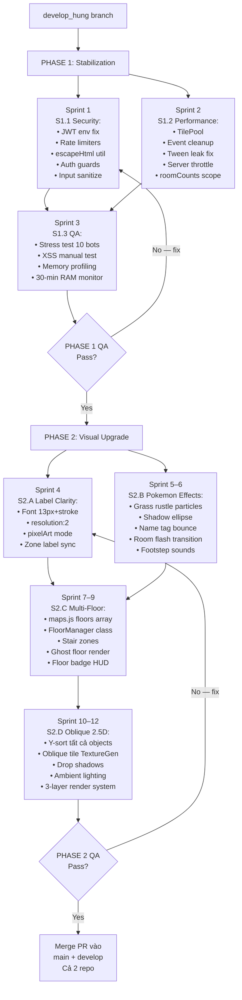

# DEVER TOWN v0.5 — Kế Hoạch Phát Triển Toàn Diện

> Branch: `develop_hung` | Chưa merge vào `main`/`develop` cho đến khi PHASE 1 + PHASE 2 đều hoàn tất QA

---

## Tổng Quan Chiến Lược

```
PHASE 1 — Stabilization (Làm trước, bắt buộc)
├── S1.1: Security Hardening (Bảo mật)
├── S1.2: Performance Optimization (Hiệu năng)
└── S1.3: Bug Fix & QA

PHASE 2 — Visual Upgrade (Làm sau, khi PHASE 1 pass)
├── S2.A: Label Clarity (chữ sắc nét)
├── S2.B: Pokemon GBA-style Movement & Effects
├── S2.C: Multi-Floor System (Stardew Valley)
└── S2.D: Oblique 2.5D Visual Style
```

> [!IMPORTANT]
> Không bắt đầu PHASE 2 khi PHASE 1 còn bug hoặc chưa pass QA. Mỗi sprint auto-commit và push lên `develop_hung`.

---

## PHASE 1 — Stabilization

### S1.1 — Security Hardening

#### Lỗ hổng #1: JWT Secret hardcode — CRITICAL
**File**: [`authMiddleware.js`](file:///D:/THStudy/DeverClub/DEVER_TOWN/server/middleware/authMiddleware.js#L4)
```js
// HIỆN TẠI — nguy hiểm nếu code bị leak
const JWT_SECRET = process.env.JWT_SECRET || 'dever_town_super_secret_jwt_key_2026';
```
**Rủi ro**: Nếu source code bị lộ (GitHub public), attacker có thể tự tạo JWT token hợp lệ → bypass toàn bộ auth.

**Fix**:
```js
const JWT_SECRET = process.env.JWT_SECRET;
if (!JWT_SECRET) {
  console.error('[FATAL] JWT_SECRET environment variable is not set!');
  process.exit(1); // Dừng server ngay nếu không có secret
}
```
Thêm vào `.env.example`:
```
JWT_SECRET=your_very_long_random_secret_here_min_64_chars
```

**Risk nếu không fix**: Attacker tạo JWT token admin giả → full access.
**Rollback**: Revert file, đặt lại fallback tạm thời.

---

#### Lỗ hổng #2: Rate Limiting thiếu cho 4 socket events — HIGH
**File**: [`socketHandler.js`](file:///D:/THStudy/DeverClub/DEVER_TOWN/server/socket/socketHandler.js)

| Event | Hiện trạng | Rủi ro |
|-------|-----------|--------|
| `sendFriendRequest` | KHÔNG có limit | Spam lời mời → flood victim |
| `sendPrivateMessage` | KHÔNG có limit | Spam tin nhắn riêng |
| `playerEmote` | KHÔNG có limit | Emote flood → UI spam |
| `updateWardrobe` | KHÔNG có limit | Brute-force object injection |

**Fix — Tạo `server/utils/rateLimiter.js`:**
```js
export function createSocketRateLimiter(maxRequests, windowMs) {
  return (socket, eventKey) => {
    const key = `_rl_${eventKey}`;
    const now = Date.now();
    if (!socket[key]) socket[key] = [];
    socket[key] = socket[key].filter(ts => now - ts < windowMs);
    if (socket[key].length >= maxRequests) {
      console.warn(`[RateLimit] ${socket.id} exceeded limit on ${eventKey}`);
      return false;
    }
    socket[key].push(now);
    return true;
  };
}
```

**Áp dụng trong `socketHandler.js`:**
```js
import { createSocketRateLimiter } from '../utils/rateLimiter.js';
const friendReqLimiter = createSocketRateLimiter(5, 60000);   // 5 lời mời/phút
const privateMsgLimiter = createSocketRateLimiter(1, 400);    // 1 msg/400ms
const emoteLimiter = createSocketRateLimiter(1, 2000);        // 1 emote/2 giây
const wardrobeLimiter = createSocketRateLimiter(1, 5000);     // 1 update/5 giây

socket.on('sendFriendRequest', (data) => {
  if (!friendReqLimiter(socket, 'sendFriendRequest')) return;
  // ...
});
```

**Risk nếu không fix**: Bot script có thể spam friend requests, private messages → DoS trải nghiệm user.

---

#### Lỗ hổng #3: Input sanitization thiếu phía server — HIGH

**Player name không được strip HTML**:
```js
// socketHandler.js — joinGame handler, thêm:
const rawName = (clientData.name || 'Dever Member').trim();
clientData.name = rawName
  .replace(/[<>"'`&]/g, '')   // Strip HTML/JS injection chars
  .replace(/\s+/g, ' ')       // Normalize whitespace
  .slice(0, 30);              // Max 30 ký tự
if (!clientData.name) clientData.name = 'Dever Member';
```

**Wardrobe payload không validate schema**:
```js
// socketHandler.js — updateWardrobe handler
socket.on('updateWardrobe', ({ wardrobeConfig }) => {
  const ALLOWED_KEYS = ['gender', 'hairstyle', 'hairColor', 'outfitType',
                        'hoodieColor', 'collarColor', 'pantsColor', 'accessory'];
  const configStr = JSON.stringify(wardrobeConfig || {});
  if (configStr.length > 2048) {
    return socket.emit('error', { message: 'Dữ liệu trang phục vượt quá giới hạn.' });
  }
  const sanitizedConfig = {};
  ALLOWED_KEYS.forEach(k => {
    if (wardrobeConfig?.[k] !== undefined) {
      sanitizedConfig[k] = String(wardrobeConfig[k]).slice(0, 50);
    }
  });
  const updated = playerManager.updateWardrobe(socket.id, sanitizedConfig);
  // ...
});
```

**Risk nếu không fix**: Stored XSS nếu player name được render vào DOM; payload injection nếu wardrobeConfig được lưu DB không qua validate.

---

#### Lỗ hổng #4: Auth guard thiếu cho sensitive events — MEDIUM

```js
// socketHandler.js — thêm helper
function requireAuth(socket, next) {
  if (!socket.authUser?.id) {
    socket.emit('error', { message: 'Yêu cầu đăng nhập để thực hiện hành động này.' });
    return false;
  }
  return true;
}

// Áp dụng cho:
socket.on('updateProfile', (data) => {
  if (!requireAuth(socket)) return;
  // ...
});

socket.on('updateWardrobe', ({ wardrobeConfig }) => {
  if (!requireAuth(socket)) return;
  // ...
});

socket.on('sendFriendRequest', (data) => {
  if (!requireAuth(socket)) return;
  // ...
});
```

**Risk nếu không fix**: Guest có thể gọi `updateWardrobe`, `updateProfile` và ghi đè dữ liệu người khác nếu có bug trong playerManager.

---

#### Lỗ hổng #5: IP Forwarding có thể bị spoof — MEDIUM

**File**: [`socketHandler.js`](file:///D:/THStudy/DeverClub/DEVER_TOWN/server/socket/socketHandler.js#L15)
```js
// HIỆN TẠI — x-forwarded-for có thể bị client spoof
const clientIp = socket.handshake.headers['x-forwarded-for'] || socket.handshake.address;
```

**Fix trong server.js:**
```js
// Nếu chạy sau Nginx/Cloudflare:
app.set('trust proxy', 1);
// Sau đó socket.request.socket.remoteAddress đã là IP thật
```

**Fix trong socketHandler.js:**
```js
// Lấy IP an toàn hơn, tránh bị spoof
function getClientIp(socket) {
  // Nếu trust proxy đã được set → socket.handshake.address là IP thật
  const forwarded = socket.handshake.headers['x-forwarded-for'];
  if (forwarded) {
    // Chỉ lấy IP đầu tiên (real client, không phải proxy chain cuối)
    return forwarded.split(',')[0].trim();
  }
  return socket.handshake.address || '127.0.0.1';
}
```

---

#### Lỗ hổng #6: pendingApprovals memory leak — MEDIUM

```js
// socketHandler.js — thêm cleanup interval
const APPROVAL_CLEANUP_INTERVAL = 30000; // 30 giây
setInterval(() => {
  const now = Date.now();
  let cleaned = 0;
  for (const [reqId, pending] of pendingApprovals.entries()) {
    if (now - pending.createdAt > 60000) { // 60 giây
      clearTimeout(pending.timeoutHandle);
      pendingApprovals.delete(reqId);
      cleaned++;
    }
  }
  if (cleaned > 0) {
    console.log(`[Cleanup] Đã xóa ${cleaned} pending approvals hết hạn`);
  }
}, APPROVAL_CLEANUP_INTERVAL);
```

---

#### Lỗ hổng #7: innerHTML với user data — MEDIUM

**Phát hiện qua audit**: Nhiều file dùng `innerHTML` với dữ liệu user (name, message) mà không escape:

```js
// FriendsListModal.js line 333 — NGUY HIỂM nếu name chứa HTML
card.innerHTML = `<div class="friend-name">${friend.name}</div>`
```

**Fix — Tạo `src/utils/sanitize.js`:**
```js
/**
 * Escape HTML entities để ngăn XSS khi insert vào innerHTML
 */
export function escapeHtml(str) {
  if (!str) return '';
  return String(str)
    .replace(/&/g, '&amp;')
    .replace(/</g, '&lt;')
    .replace(/>/g, '&gt;')
    .replace(/"/g, '&quot;')
    .replace(/'/g, '&#39;');
}
```

**Áp dụng trong tất cả các file có innerHTML với user data**:
```js
import { escapeHtml } from '../../utils/sanitize.js';
// ...
card.innerHTML = `<div class="friend-name">${escapeHtml(friend.name)}</div>`;
```

**Danh sách file cần update**:
- `FriendsListModal.js` lines 333, 426
- `ChatBox.js` — check toàn bộ message render
- `QuestManager.js` line 392 — `toast.innerHTML`
- `InteractiveModal.js` — `getAvatarInitials(pName)` truyền vào innerHTML

---

### S1.2 — Performance Optimization

#### Perf #1: TilePool — Giảm 70% GC khi switch room
**File**: `WorldScene.js` — `loadRoom()` destroy & create ~475 tile objects mỗi lần switch room

**Tạo `src/utils/TilePool.js`:**
```js
export class TilePool {
  constructor(scene, poolSize = 600) {
    this.scene = scene;
    this.pool = [];
    this.active = new Set();
    
    for (let i = 0; i < poolSize; i++) {
      const img = scene.add.image(-9999, -9999, 'town_tileset', 0);
      img.setVisible(false).setActive(false);
      this.pool.push(img);
    }
  }
  
  acquire(x, y, frame, depth = 0) {
    let obj = this.pool.find(o => !o.active);
    if (!obj) {
      // Pool exhausted: tạo mới (không thường xuyên xảy ra)
      obj = this.scene.add.image(x, y, 'town_tileset', frame);
    }
    obj.setPosition(x, y).setFrame(frame).setDepth(depth)
       .setVisible(true).setActive(true);
    this.active.add(obj);
    return obj;
  }
  
  releaseAll() {
    for (const obj of this.active) {
      obj.setVisible(false).setActive(false).setPosition(-9999, -9999);
    }
    this.active.clear();
  }
  
  destroy() {
    this.pool.forEach(o => o.destroy());
    this.pool = [];
    this.active.clear();
  }
}
```

**Tích hợp vào WorldScene.js:**
```js
// Trong create():
this.tilePool = new TilePool(this, 600);

// Trong loadRoom() — thay destroy loop bằng:
this.tilePool.releaseAll();  // O(n) thay vì O(n) destroy + create mới
```

---

#### Perf #2: Viewport Culling — Không render tiles ngoài màn hình

```js
// WorldScene.js — loadRoom()
buildTiles(mapData) {
  const cam = this.cameras.main;
  const worldView = cam.worldView;
  const BUFFER = GAME_CONFIG.TILE_SIZE * 2; // 2-tile buffer xung quanh viewport
  
  for (let r = 0; r < rows; r++) {
    for (let c = 0; c < cols; c++) {
      const px = c * tileSize + tileSize / 2;
      const py = r * tileSize + tileSize / 2;
      
      // Culling: bỏ qua tiles hoàn toàn ngoài view
      if (px < worldView.left - BUFFER || px > worldView.right + BUFFER) continue;
      if (py < worldView.top - BUFFER || py > worldView.bottom + BUFFER) continue;
      
      const tileType = mapData.layout[r][c];
      this.tilePool.acquire(px, py, tileType, py); // depth = y (Y-sort)
    }
  }
}
```

> [!NOTE]
> Khi camera di chuyển, cần dynamic tile streaming (xem Perf #3)

---

#### Perf #3: Dynamic Tile Streaming khi Camera Di Chuyển

```js
// WorldScene.js — update() hoặc camera bound change event
updateVisibleTiles() {
  const cam = this.cameras.main;
  const newBounds = cam.worldView;
  
  // Chỉ rebuild nếu camera đã dịch chuyển > 32px (1 tile)
  if (this._lastCamBounds && 
      Math.abs(newBounds.x - this._lastCamBounds.x) < 32 &&
      Math.abs(newBounds.y - this._lastCamBounds.y) < 32) return;
  
  this._lastCamBounds = { ...newBounds };
  this.buildTiles(MAPS_CONFIG[this.currentRoomId]);
}
```

---

#### Perf #4: Event Listener Cleanup — Ngăn Memory Leak

```js
// WorldScene.js — thêm vào constructor()
this._resizeHandler = () => this.updateCameraZoom();
this._orientationHandler = () => setTimeout(() => this.updateCameraZoom(), 150);

// Trong create() — thay vì anonymous functions:
window.addEventListener('resize', this._resizeHandler);
window.addEventListener('orientationchange', this._orientationHandler);

// Thêm shutdown():
shutdown() {
  window.removeEventListener('resize', this._resizeHandler);
  window.removeEventListener('orientationchange', this._orientationHandler);
  
  // Cleanup socket listeners khi reconnect
  if (this.socketManager?.socket) {
    this.socketManager.socket.removeAllListeners();
  }
  
  // Cleanup tile pool
  if (this.tilePool) {
    this.tilePool.destroy();
  }
  
  // Cleanup intervals
  ['_pingInterval', '_toastTimer'].forEach(key => {
    if (this[key]) clearInterval(this[key]);
  });
}
```

---

#### Perf #5: Server-side Optimization

**Giảm playerMovement throttle:**
```js
// socketHandler.js line 274
// TRƯỚC: 35 packets/giây
if (socket._movePackets.length > 35) return;

// SAU: 20 packets/giây + delta compression (chỉ broadcast nếu thay đổi > 2px)
if (socket._movePackets.length > 20) return;

const lp = socket._lastBroadcastPos;
const dx = Math.abs(movementData.x - (lp?.x || 0));
const dy = Math.abs(movementData.y - (lp?.y || 0));
if (!movementData.isMoving && dx < 2 && dy < 2) return; // Skip nếu đứng yên, không đổi vị trí đáng kể
socket._lastBroadcastPos = { x: movementData.x, y: movementData.y, isMoving: movementData.isMoving };
```

**Room-scoped roomCounts broadcast:**
```js
// TRƯỚC: io.emit('roomCounts') → broadcast TẤT CẢ clients
io.emit('roomCounts', playerManager.getRoomCounts());

// SAU: Chỉ broadcast cho room liên quan
// Vì roomCounts hiển thị số người mỗi room → tất cả room đều cần update
// Nhưng có thể giảm tần suất: chỉ emit khi count thực sự thay đổi
const newCounts = playerManager.getRoomCounts();
if (JSON.stringify(newCounts) !== JSON.stringify(this._lastRoomCounts)) {
  this._lastRoomCounts = newCounts;
  io.emit('roomCounts', newCounts);
}
```

**RemotePlayer equippedContainer tween leak:**
```js
// RemotePlayer.js — createEquippedItemDisplay()
// Tween với repeat: -1 không bao giờ tự stop → tích lũy khi update wardrobe nhiều lần
// Fix: store tween reference và stop trước khi create mới
if (this._equippedTween) {
  this._equippedTween.stop();
  this._equippedTween = null;
}
this._equippedTween = this.scene.tweens.add({
  targets: this.equippedContainer,
  // ...
  repeat: -1,
});
// Trong destroy():
if (this._equippedTween) { this._equippedTween.stop(); }
```

---

### S1.3 — Bug Fix & QA Checklist

| Bug | File | Mô tả | Fix |
|-----|------|-------|-----|
| Guest gọi auth-only events | `socketHandler.js` | Guest có thể gọi `updateProfile`/`updateWardrobe` | Thêm `requireAuth()` guard |
| pendingApprovals leak | `socketHandler.js` | Entries cũ không được cleanup | Cleanup interval 30s |
| equippedContainer tween leak | `RemotePlayer.js` | `repeat: -1` tween tích lũy mỗi lần `setEquippedItem()` | Store tween ref + stop() |
| window.resize listener leak | `WorldScene.js` | Anonymous function không removeEventListener được | Dùng named reference |
| innerHTML XSS risk | Nhiều file | User-controlled data vào innerHTML | Dùng `escapeHtml()` util |
| JWT fallback secret | `authMiddleware.js` | Secret hardcode trong code | Require env var |
| Move throttle quá cao | `socketHandler.js` | 35 pkt/s × N players = quá tải | Giảm xuống 20 pkt/s |

**QA Test Checklist PHASE 1:**
- [ ] Mở browser DevTools → Network → WebSocket → kiểm tra không có bất thường packet khi idle
- [ ] Stress test: mở 5 tab cùng lúc cùng 1 account → multi-device flow hoạt động đúng
- [ ] Thử gửi `<script>alert(1)</script>` làm player name → không execute
- [ ] Monitor RAM trong 30 phút chơi → không tăng liên tục
- [ ] Switch room 20 lần liên tiếp → FPS ổn định, không lag tăng dần
- [ ] Build production + chạy với 10 Puppeteer bots → server không crash

---

## PHASE 2 — Visual Upgrade

> Bắt đầu PHASE 2 **sau khi** PHASE 1 QA pass hoàn toàn.

### Nghiên Cứu: Pokemon GBA + Stardew Valley Mechanics

Dựa trên phân tích kỹ thuật từ Pokemon FireRed/Emerald (GBA) và Stardew Valley:

#### Hệ thống Layer (Stardew Valley)
Stardew Valley dùng **5 layer** render theo thứ tự:
1. `Back` — Nền đất, cỏ, đường đi
2. `Buildings` — Tường, cửa, tòa nhà (cố định theo Y)
3. `Paths` — Đường mòn, walkable zones
4. `Front` — Đồ vật cao hơn nhân vật (cây to, tường cao)
5. `AlwaysFront` — UI overlay, tên nhân vật

**Áp dụng cho DEVER TOWN**: Mở rộng từ 1 layer hiện tại → 3 layer tối giản:
- `layer_ground` — Floor tiles (cỏ, gỗ, thảm)
- `layer_objects` — Furniture, obstacles (Y-sort với player)
- `layer_overlay` — Mái nhà, cây tán che (luôn trên nhân vật)

#### Pokemon GBA — Walking Animations
- Nhân vật bước 2 frame luân phiên (chân trái/phải) khi di chuyển
- Khi đứng yên: 1 frame idle (nhìn thẳng, tay thả)
- Transition: 1 step = 1 tile (16px hoặc 32px mỗi bước)
- **Grass rustle effect**: Khi bước qua tile cỏ → particle cỏ xòe ra hai bên

#### Pokemon GBA — Step-based movement
- Top-down 2D, không Y-sort depth (hoàn toàn flat)
- Nhưng có **shadow sprite** nhỏ dưới chân nhân vật → tạo cảm giác depth

#### Stardew Valley — Character Depth & Leg Bobbing
- Y-sort depth: object ở Y cao hơn → depth thấp hơn (behind player)
- Nhân vật có animation bước chân **bob lên xuống** nhẹ khi đi
- **Shadow**: Ellipse shadow dưới chân, scale theo animation frame
- Khi chạy vào building: **instant black fade** → interior load → fade in

#### Stardew Valley — Multi-Floor Architecture
- Outdoor → Indoor: **Warp trigger** tại vị trí cửa → fade black → scene mới
- Indoor tầng 1 → tầng 2: Dùng **ladder/stair tile** + warp lên tầng trên
- Khi ở trong nhà: Tường phía Bắc **trong suốt** (alpha = 0) để nhìn thấy nhân vật
- Hệ thống tầng: Mỗi tầng là một **sub-map** riêng biệt với layout 2D riêng

---

### S2.A — Label Clarity (Chữ Sắc Nét)

#### Chi tiết kỹ thuật

**Vấn đề root cause**: Phaser Text object render tại device pixel ratio 1x, khi camera zoom 1.32x → bị bilinear blur.

**Fix 1 — Resolution Scale cho Text:**
```js
// WorldScene.js — loadRoom(), portal label creation
const label = this.add.text(avgX, clampedY, portalText, {
  fontFamily: "'JetBrains Mono', 'Outfit', monospace",
  fontSize: '13px',
  fontStyle: 'bold',
  color: '#e9d5ff',
  stroke: '#1e1b4b',
  strokeThickness: 3,
  backgroundColor: 'rgba(15, 23, 42, 0.92)',
  padding: { x: 8, y: 3 },
  resolution: window.devicePixelRatio || 2  // Sắc nét trên HiDPI
}).setOrigin(0.5, 0.5).setDepth(99999);
```

**Fix 2 — pixelArt mode trong Phaser config (src/main.js):**
```js
const config = {
  type: Phaser.AUTO,
  // ...
  render: {
    antialias: false,       // Tắt antialias toàn bộ → pixel-perfect
    roundPixels: true,      // Round pixel positions → không sub-pixel blur
    pixelArt: true          // Nearest-neighbor texture scaling
  }
};
```

> [!WARNING]
> `pixelArt: true` có thể làm tròn edges pixel art trông cứng hơn. Test trước trên màn hình nhỏ.

**Fix 3 — Zone tooltip labels (InteractionManager):**
```js
// InteractionManager.js — floating [E] hint label
const zoneLabel = scene.add.text(zone.tileX * 32 + 16, zone.tileY * 32 - 20, `[E] ${zone.label}`, {
  fontFamily: "'JetBrains Mono', monospace",
  fontSize: '12px',
  fontStyle: 'bold',
  color: '#fbbf24',         // Vàng gold dễ nhìn
  stroke: '#1e1b4b',
  strokeThickness: 3,
  resolution: 2
}).setOrigin(0.5, 1).setDepth(99998).setVisible(false);
```

**Risk**: `pixelArt: true` break WebGL post-processing (vignette effect) → test kỹ trước deploy.
**Rollback**: Set `pixelArt: false`, chỉ giữ `resolution: 2` trên Text objects.

---

### S2.B — Pokemon GBA-Style Movement & Visual Effects

#### B1: Grass Rustle Effect (Pokemon-style)
Khi nhân vật bước qua tile cỏ (tile type 0, 7, 24), tạo hiệu ứng cỏ xòe:

```js
// JuiceManager.js — thêm method
spawnGrassRustle(x, y) {
  // 4-6 particle nhỏ màu xanh lá phóng ra 2 bên
  const particles = this.scene.add.particles(x, y, 'town_tileset', {
    frame: 0,  // grass tile frame
    lifespan: 300,
    speed: { min: 20, max: 50 },
    angle: { min: 200, max: 340 }, // bên trái và phải
    scale: { start: 0.3, end: 0 },
    alpha: { start: 0.8, end: 0 },
    quantity: 4,
    tint: [0x22c55e, 0x4ade80, 0x86efac],
    emitting: false
  });
  particles.explode(4, x, y);
  this.scene.time.delayedCall(500, () => particles.destroy());
}
```

**Trong Player.js — update():**
```js
// Khi player bước, check tile dưới chân
if (isMoving && this.scene.juiceManager) {
  const tileX = Math.floor(this.x / 32);
  const tileY = Math.floor(this.y / 32);
  const tileType = mapData.layout[tileY]?.[tileX];
  const grassTiles = new Set([0, 7, 24]); // cỏ thường, hoa, cỏ sân bóng
  if (grassTiles.has(tileType) && Date.now() - this._lastGrassEffect > 200) {
    this._lastGrassEffect = Date.now();
    this.scene.juiceManager.spawnGrassRustle(this.x, this.y + 10);
  }
}
```

#### B2: Character Shadow Sprite (Depth feeling)
```js
// Player.js — create()
this.shadowEllipse = scene.add.ellipse(x, y + 12, 24, 8, 0x000000, 0.25);
this.shadowEllipse.setDepth(this.y - 0.1); // Luôn ngay dưới player

// Trong update():
this.shadowEllipse.setPosition(this.x, this.y + 12);
this.shadowEllipse.setDepth(this.y - 0.1);
// Scale shadow khi di chuyển (nhẹ)
const bobScale = isMoving ? (0.9 + Math.sin(Date.now() / 120) * 0.1) : 1;
this.shadowEllipse.setScale(bobScale, 1);
```

#### B3: Footstep Sound Variation
```js
// AudioManager.js — thêm footstep sounds
playFootstep(tileType) {
  const soundMap = {
    grass: 'sfx_step_grass',
    wood: 'sfx_step_wood',
    stone: 'sfx_step_stone',
    cyber: 'sfx_step_cyber',
  };
  const tileToSurface = {
    0: 'grass', 7: 'grass', 24: 'grass',
    1: 'wood', 31: 'wood',
    5: 'stone', 23: 'stone',
    9: 'cyber', 18: 'cyber'
  };
  const surface = tileToSurface[tileType] || 'stone';
  // Play với random pitch variation ±5% để nghe không đều nhàm
  this.playWithPitchVariation(soundMap[surface], 0.95 + Math.random() * 0.1);
}
```

#### B4: NPC/Remote Player Name Tag Animation
```js
// RemotePlayer.js — nameTagContainer hover animation
// Khi player mới xuất hiện: bounce in
this.scene.tweens.add({
  targets: this.nameTagContainer,
  y: { from: this.y - 40, to: this.y - 28 },
  alpha: { from: 0, to: 1 },
  duration: 300,
  ease: 'Back.easeOut'
});

// Khi player disconnect: fade out scale down
this.scene.tweens.add({
  targets: this.nameTagContainer,
  y: this.y - 40,
  alpha: 0,
  duration: 250,
  onComplete: () => this.nameTagContainer?.destroy()
});
```

#### B5: Transition Effect khi Vào Phòng (Pokemon-style fade)
```js
// WorldScene.js — handlePortalOverlap()
// HIỆN TẠI: fadeOut màu đen đơn giản
// CẢI TIẾN: Thêm "flash" trắng nhanh như Pokemon GBA

this.cameras.main.flash(80, 255, 255, 255, false); // White flash nhanh
this.scene.time.delayedCall(80, () => {
  this.cameras.main.fadeOut(150, 0, 0, 0); // Fade to black
  this.cameras.main.once('camerafadeoutcomplete', () => {
    this.loadRoom(...);
    this.cameras.main.fadeIn(200, 0, 0, 0);
  });
});
```

---

### S2.C — Multi-Floor System (Stardew Valley-inspired)

#### Kiến Trúc Dữ Liệu

**Mở rộng `maps.js` để hỗ trợ multi-floor:**
```js
main_hall: {
  id: 'main_hall',
  name: 'Tòa Alpha — Sảnh Chính',
  floors: [
    {
      floorIndex: 0,
      name: 'Tầng 1',
      layout: [ /* layout 25x19 hiện tại */ ],
      zones: [ /* zones hiện tại */ ],
      portals: [ /* portals hiện tại */ ],
      stairZones: [
        { tileX: 22, tileY: 3, targetFloor: 1, direction: 'up', label: 'Lên Tầng 2' }
      ],
      ambientTheme: 'main_hall',
      musicTrack: 'bgm_lobby'
    },
    {
      floorIndex: 1,
      name: 'Tầng 2 — Phòng Họp Ban Lãnh Đạo',
      layout: [
        // Layout 25x12 nhỏ hơn, chỉ nội thất nội bộ
        [ 2, 2, 2, ... ],
        // ...
      ],
      zones: [
        { id: 'zone_floor2_meeting', type: 'meeting_stage', tileX: 12, tileY: 5, label: 'Họp Ban Lãnh Đạo' }
      ],
      portals: [],
      stairZones: [
        { tileX: 22, tileY: 3, targetFloor: 0, direction: 'down', label: 'Xuống Tầng 1' }
      ],
      ambientTheme: 'indoor_cozy',
      musicTrack: 'bgm_lofi'
    }
  ]
}
```

#### FloorManager Class

**Tạo `src/managers/FloorManager.js`:**
```js
export class FloorManager {
  constructor(scene) {
    this.scene = scene;
    this.currentFloor = 0;
    this.floorHistory = []; // Stack để navigate back
  }
  
  getCurrentFloorData(roomId) {
    const roomData = MAPS_CONFIG[roomId];
    if (!roomData.floors) return roomData; // Backward compat: room không có floors
    return roomData.floors[this.currentFloor] || roomData.floors[0];
  }
  
  async transitionToFloor(targetFloor, stairInfo) {
    if (this.isTransitioning) return;
    this.isTransitioning = true;
    
    // 1. Pokemon-style flash + fade
    this.scene.cameras.main.flash(60, 255, 255, 255);
    await this.delay(60);
    this.scene.cameras.main.fadeOut(200, 11, 15, 25);
    await this.delay(200);
    
    // 2. Rebuild floor
    this.currentFloor = targetFloor;
    this.scene.rebuildCurrentFloor();
    
    // 3. Spawn player tại vị trí stair đích
    const spawnX = stairInfo.spawnX || this.scene.player.x;
    const spawnY = stairInfo.spawnY || this.scene.player.y;
    this.scene.player.setPosition(spawnX, spawnY);
    
    // 4. Fade in + hiện Floor Badge
    this.scene.cameras.main.fadeIn(250, 11, 15, 25);
    this.showFloorBadge(targetFloor);
    
    await this.delay(300);
    this.isTransitioning = false;
  }
  
  showFloorBadge(floorIndex) {
    // Toast nhỏ "Tầng 2 — Phòng Họp" xuất hiện 2 giây
    const floorData = this.scene.floorManager.getCurrentFloorData(this.scene.currentRoomId);
    this.scene.showToast(`Tầng ${floorIndex + 1} — ${floorData.name}`);
  }
  
  delay(ms) {
    return new Promise(resolve => setTimeout(resolve, ms));
  }
}
```

#### Floor Fade Ghost Effect (Stardew Valley)

Khi đứng ở tầng 2, có thể thấy mờ mờ tầng 1 bên dưới:
```js
// FloorManager.js — renderGhostFloor()
renderGhostFloor(floorIndex) {
  const floorData = this.scene.mapData.floors[floorIndex];
  if (!floorData) return;
  
  // Render tầng ghost với alpha thấp, scale nhẹ
  floorData.layout.forEach((row, r) => {
    row.forEach((tileType, c) => {
      const px = c * 32 + 16;
      const py = r * 32 + 16 + 8; // offset xuống 8px để có cảm giác bên dưới
      const ghost = this.scene.add.image(px, py, 'town_tileset', tileType);
      ghost.setAlpha(0.22);
      ghost.setTint(0x334155); // Tông xanh tối mờ
      ghost.setDepth(-10);    // Luôn dưới tất cả
      this._ghostTiles.push(ghost);
    });
  });
}
```

#### UI: Floor Navigator HUD
- Badge góc trên-trái: `Tầng 1 / 2` với nút mũi tên lên/xuống
- Click mũi tên → trigger `floorManager.transitionToFloor()`
- Chỉ hiện khi room có `floors.length > 1`

---

### S2.D — Oblique 2.5D Visual Style

#### D1: Y-Sort Depth System
Đây là foundation của mọi depth effect. Áp dụng toàn bộ:

```js
// WorldScene.js — loadRoom()
// Thay setDepth(0) bằng setDepth(posY) cho obstacles
const tileSprite = this.tilePool.acquire(posX, posY, tileType, posY); // depth = Y

// Player.js — update()
this.setDepth(this.y + 16); // +16 để base ở đáy chân

// RemotePlayer.js — update() (đã có setDepth(this.y))
// nameTagContainer luôn trên nhân vật
this.nameTagContainer.setDepth(this.y + 10000);
```

#### D2: Oblique Wall Tiles (Cabinet Projection)
Thêm 6 tile mới trong `TextureGenerator.js`:

```js
// Tường có chiều cao 2D (top face + front face)
static drawWallNorthFace(ctx, x, y, size) {
  // Phần đỉnh tường (nhìn từ trên xuống, oblique)
  ctx.fillStyle = '#64748b';  // Màu sáng hơn (top face)
  ctx.fillRect(x, y, size, 10); // 10px top face (nhìn thấy mặt đứng giả)
  // Phần thân tường (front face, màu tối hơn)
  ctx.fillStyle = '#475569';
  ctx.fillRect(x, y + 10, size, size - 10);
  // Đường shadow phân chia top/front
  ctx.fillStyle = '#1e293b';
  ctx.fillRect(x, y + 10, size, 1);
}

// Furniture có chiều cao (bàn, kệ...)
static drawDeskOblique(ctx, x, y, size) {
  // Mặt trên bàn (top, màu sáng)
  ctx.fillStyle = '#a16207';
  ctx.fillRect(x + 2, y + 4, size - 4, 10);
  // Mặt trước (front, màu tối)
  ctx.fillStyle = '#78350f';
  ctx.fillRect(x + 2, y + 14, size - 4, size - 16);
  // Góc bóng
  ctx.fillStyle = '#3d1a08';
  ctx.fillRect(x + size - 5, y + 14, 3, size - 16);
  // Chân bàn
  ctx.fillStyle = '#451a03';
  ctx.fillRect(x + 4, y + size - 4, 4, 4);
  ctx.fillRect(x + size - 8, y + size - 4, 4, 4);
}
```

**Danh sách tiles cần vẽ lại theo oblique style:**
- `drawWallNorthFace` — Tường phía Bắc
- `drawBookshelfOblique` — Kệ sách có chiều sâu
- `drawDeskOblique` — Bàn làm việc
- `drawServerRackOblique` — Server rack
- `drawWhiteboardOblique` — Bảng trắng
- `drawCoffeeBarOblique` — Quầy cà phê

#### D3: Drop Shadow cho Obstacles
```js
// WorldScene.js — khi tạo obstacle tile
if (solidTiles.has(tileType)) {
  // Tạo shadow ellipse dưới obstacle
  const shadowW = tileSize * 0.7;
  const shadowH = tileSize * 0.2;
  const shadow = this.add.ellipse(posX + 4, posY + tileSize * 0.35, shadowW, shadowH, 0x000000, 0.2);
  shadow.setDepth(posY - 1); // Ngay trước tile, sau background
}
```

#### D4: Ambient Lighting Zones (Stardew Valley-inspired)

Stardew Valley dùng ambient light layers để tạo cảm giác không gian. DEVER TOWN có thể implement lightweight version:

```js
// AmbientEnvironmentManager.js — mở rộng setRoom()
setRoom(roomId) {
  const lightingConfig = {
    main_hall: { ambientTint: 0xffffff, alpha: 0 },          // Không filter (sảnh sáng)
    dever_lab: { ambientTint: 0x0f172a, alpha: 0.08 },       // Tối nhẹ, xanh cyber
    library_lounge: { ambientTint: 0xfef3c7, alpha: 0.06 },  // Ấm vàng (đèn đọc sách)
    memory_room: { ambientTint: 0x1e1b4b, alpha: 0.10 },     // Tím tối (museum)
    canteen_cafe: { ambientTint: 0xfef9c3, alpha: 0.05 },    // Ấm áp cafe
    sports_complex: { ambientTint: 0xd1fae5, alpha: 0.04 },  // Xanh ngoài trời
  };
  
  const cfg = lightingConfig[roomId] || { ambientTint: 0xffffff, alpha: 0 };
  this.applyAmbientLight(cfg);
}

applyAmbientLight({ ambientTint, alpha }) {
  // Dùng Phaser camera setTint hoặc overlay graphics
  if (alpha > 0) {
    if (!this.lightOverlay) {
      this.lightOverlay = this.scene.add.rectangle(
        GAME_CONFIG.MAP_WIDTH / 2, GAME_CONFIG.MAP_HEIGHT / 2,
        GAME_CONFIG.MAP_WIDTH, GAME_CONFIG.MAP_HEIGHT,
        ambientTint, alpha
      ).setDepth(999990).setScrollFactor(0);
    } else {
      this.lightOverlay.setFillStyle(ambientTint, alpha);
    }
  }
}
```

---

## Risk Registry (22 Rủi Ro Đã Xác Định)

| # | Rủi Ro | Xác Suất | Impact | Mitigation | Rollback |
|---|--------|---------|--------|------------|---------|
| R01 | JWT secret bị lộ qua GitHub | Thấp | Critical | Require env var, không fallback | Revoke token, rotate secret |
| R02 | Spam friend requests làm flood | Cao | High | Rate limit 5/phút | Remove limit tạm thời |
| R03 | XSS qua player name | Thấp | High | escapeHtml() tất cả innerHTML | Disable display, sanitize DB |
| R04 | Memory leak tích lũy (tween, listener) | Cao | High | Named refs, cleanup hooks | Restart server, clear tab |
| R05 | TilePool exhausted (>600 tiles visible) | Thấp | Medium | Dynamic grow + log warning | Tắt pooling, dùng destroy/create |
| R06 | pixelArt mode break PostFX | Trung bình | Medium | Test riêng, feature flag | `pixelArt: false` |
| R07 | Multi-floor data break backward compat | Thấp | High | Giữ `floors` optional, fallback | Revert maps.js |
| R08 | FloorManager transition deadlock | Trung bình | High | `isTransitioning` flag + timeout 3s | Hard reset transition state |
| R09 | Viewport culling miss tiles khi camera nhanh | Trung bình | Medium | 2-tile buffer; rebuild on camera move > 1 tile | Tắt culling, render all |
| R10 | Grass particle spam lag | Trung bình | Low | Cooldown 200ms; max 10 particles/frame | Disable grass effect |
| R11 | Shadow ellipses tích lũy khi switch room | Cao | Medium | Track shadow array, destroy on room load | Clear all shadow objects |
| R12 | Oblique tile style không đồng nhất giữa các tiles | Cao | Low | Style guide + review từng tile | Giữ nguyên tile cũ |
| R13 | Y-sort depth conflict giữa overlay và player | Trung bình | Medium | Layer offset constants | Manual depth override |
| R14 | Server crash khi 50+ user đồng thời | Trung bình | Critical | Load test trước; Redis adapter plan | Scale horizontally |
| R15 | Chat XSS qua private message | Thấp | High | escapeHtml() + server sanitize | Disable private chat |
| R16 | Wardrobe payload injection | Thấp | Medium | Schema whitelist + size limit 2KB | Disable wardrobe update |
| R17 | IP spoof bypass rate limit | Thấp | Medium | Trust proxy config đúng | IP-based rate limit → socket-ID based |
| R18 | Stair zone collision với portal zone | Trung bình | Medium | Priority: stair > portal | Dùng exclusive zone check |
| R19 | Floor ghost tile quá nhiều (slow render) | Trung bình | Medium | Max ghost tiles = viewport only | Disable ghost floor |
| R20 | Ambient light overlay đè UI | Thấp | Low | Overlay depth < HUD depth, setScrollFactor(0) | Remove overlay |
| R21 | WebFont load chậm → portal label chữ sai | Thấp | Low | Font fallback chain đầy đủ | `document.fonts.ready` wait |
| R22 | Footstep sound không có file → error | Thấp | Low | Check existence trước play | Skip if not loaded |

---

## Lịch Triển Khai Chi Tiết



---

## Files Sẽ Chỉnh Sửa / Tạo Mới

| File | PHASE | Loại |
|------|-------|------|
| `server/middleware/authMiddleware.js` | P1 | Sửa: remove JWT fallback |
| `server/utils/rateLimiter.js` | P1 | **Tạo mới** |
| `server/socket/socketHandler.js` | P1 | Sửa: rate limit, auth guard, cleanup |
| `src/utils/sanitize.js` | P1 | **Tạo mới** |
| `src/utils/TilePool.js` | P1 | **Tạo mới** |
| `src/scenes/WorldScene.js` | P1, P2 | Sửa lớn |
| `src/entities/RemotePlayer.js` | P1, P2 | Sửa: tween leak, shadow, bounce |
| `src/entities/Player.js` | P2 | Sửa: shadow, grass effect |
| `src/ui/common/ChatBox.js` | P1 | Sửa: escapeHtml |
| `src/ui/gameplay/FriendsListModal.js` | P1 | Sửa: escapeHtml |
| `src/ui/gameplay/InteractiveModal.js` | P1 | Sửa: escapeHtml user data |
| `src/managers/QuestManager.js` | P1 | Sửa: escapeHtml toast |
| `src/managers/JuiceManager.js` | P2 | Sửa: thêm spawnGrassRustle |
| `src/managers/FloorManager.js` | P2 | **Tạo mới** |
| `src/managers/AmbientEnvironmentManager.js` | P2 | Sửa: ambient lighting |
| `src/config/maps.js` | P2 | Sửa: thêm floors array |
| `src/utils/TextureGenerator.js` | P2 | Sửa: oblique tile variants |
| `src/utils/AudioManager.js` | P2 | Sửa: footstep variation |
| `src/main.js` | P2 | Sửa: pixelArt render config |

---

> **Cam kết quy trình**: Mỗi Sprint kết thúc = auto `git add . && git commit && git push origin develop_hung`. Không để uncommitted changes. PHASE 1 là điều kiện tiên quyết — không bỏ qua.
